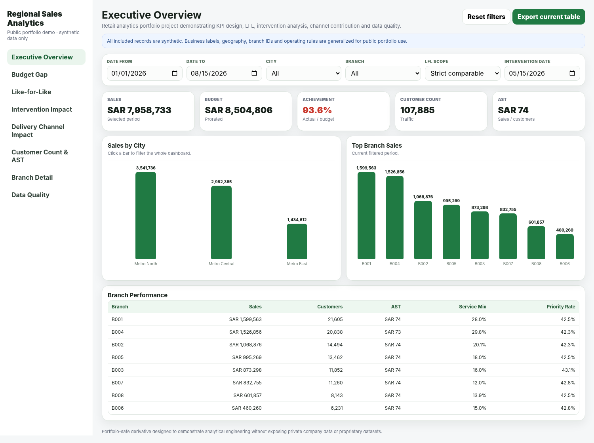
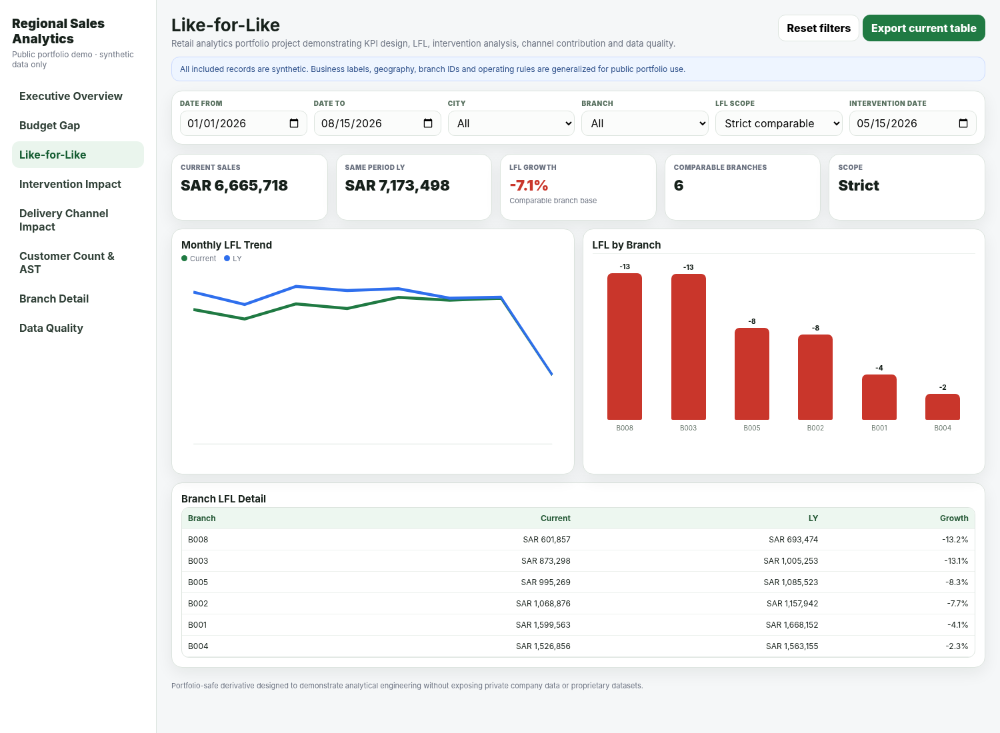
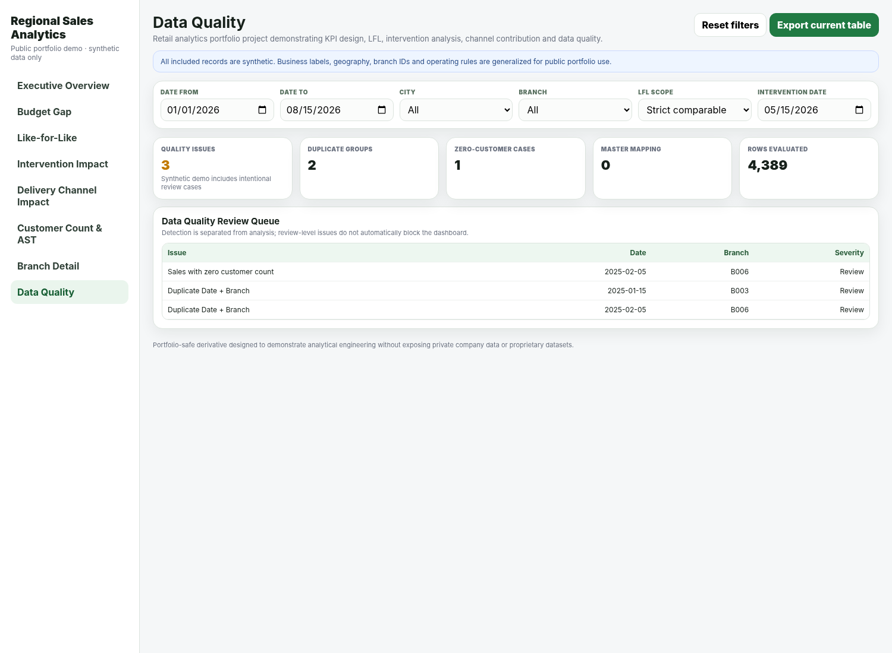

# Regional Sales Analytics Portfolio

A portfolio-safe, local-first retail analytics application demonstrating how a Data Analyst / Business Analyst can turn multi-source operational data into an interactive decision-support tool.

> **Privacy note:** this public repository contains only synthetic data and generalized business terminology. It does not include private company data, real customers, employees, prescriptions, credentials, internal servers, proprietary datasets, or confidential operating instructions.

## Executive summary

This project analyzes branch-level sales performance against budget, customer traffic, average sales per customer (AST), year-over-year like-for-like performance, intervention momentum, delivery-channel contribution, and data quality. The public repository is a sanitized derivative of a larger desktop analytics project and is designed so recruiters can review both the business thinking and technical implementation without access to any private source data.

The core analytical pattern is:

```text
Source files
   ↓
Normalization
   ↓
Central analytical state
   ↓
Filters / comparable scope
   ↓
Calculation engine
   ↓
KPIs + charts + tables
   ↓
Cross-filtering + export
```

## Business problem

A multi-branch retailer needs to answer questions such as:

- Which branches are creating the largest budget gaps?
- Is weak performance driven more by lower customer traffic or lower basket productivity?
- How is the same comparable branch base performing versus last year?
- Did performance momentum improve after a selected intervention date?
- How much is a delivery sub-channel contributing without double-counting revenue?
- Are there data-quality issues that should be reviewed before management decisions are made?

## Project objectives

- Build a single analytical model from daily sales, monthly targets, branch master data, and channel-level data.
- Maintain one calculation logic across KPIs, charts, and tables.
- Support global filtering and chart-driven cross-filtering.
- Compare current performance with the same period last year.
- Separate strict comparable-branch LFL from total-scope performance.
- Prorate budget when only part of a month is selected.
- Evaluate intervention momentum without overstating causal conclusions.
- Prevent double counting when a sub-channel is embedded inside a parent sales segment.
- Surface data-quality exceptions through a review queue.

## Dataset description

All datasets in `data/sample/` are synthetic and were generated for this repository.

| Dataset | Grain | Purpose |
|---|---|---|
| `branch_master.csv` | Branch | City, branch category, size, opening and closing dates |
| `sales_daily.csv` | Date + Branch | Core retail sales, service-channel sales, priority sales, customers |
| `monthly_budget.csv` | Month + Branch | Total and segment budgets |
| `delivery_channel.csv` | Date + Branch | Delivery-channel component already included inside core retail |

The sample intentionally includes a newly opened branch, a closed branch, an intervention period, channel activity, branch-level performance variation, and a small number of data-quality review cases.

## Tools and technologies

- **HTML5 / CSS3 / JavaScript** — local analytical application and interaction logic.
- **CSV** — public synthetic source datasets.
- **SVG / DOM-based charts** — dependency-light interactive visuals.
- **SQL** — schema, KPI, LFL, and data-quality query examples.
- **Power BI / DAX documentation** — mapping of the same analytical model to a star schema and measures.
- **Tauri 2 + Rust** — optional desktop packaging structure.
- **Git / GitHub** — version control and portfolio delivery.

## Data preparation

The public application performs these steps:

1. Loads the four synthetic CSV files.
2. Parses rows into JavaScript objects.
3. Converts numeric KPI fields to typed numbers.
4. Relates fact rows to branch master attributes.
5. Applies date, city, and branch context.
6. Calculates prorated targets for partial months.
7. Builds comparable branch sets for strict LFL.
8. Aggregates only after filters and analytical scope are applied.
9. Runs quality checks independently from the visualization layer.

## Data model

The model follows a small star-schema pattern:

```text
             DimBranch
          /      |       \
         /       |        \
 FactSales   FactBudget   FactDelivery
     |
   Date
```

See [`docs/DATA_MODEL.md`](docs/DATA_MODEL.md) for grain, keys, lifecycle logic, and relationship rules.

## KPIs

Key measures demonstrated include:

- Total Sales
- Core Retail Sales
- Service Channel Sales
- Priority Sales
- Customer Count
- AST
- Budget
- Achievement
- Budget Gap
- Core / Service segment achievement
- Priority Rate
- Service Mix
- Total and Strict LFL Growth
- Pre LFL / Post LFL
- Momentum in percentage points
- Expected Post scenario
- Estimated Recovery
- Delivery % of Core Retail
- Core Retail ex-Delivery

See [`docs/KPI_DEFINITIONS.md`](docs/KPI_DEFINITIONS.md) for formulas and interpretation rules.

## Analytical methodology

### Weighted AST

```text
AST = Total Sales / Total Customer Count
```

The application does not average daily AST values, which would create an unweighted result.

### Budget proration

For partial-month selections:

```text
Selected Budget
= Monthly Budget × Selected Calendar Days / Days in Month
```

### Like-for-like

```text
LFL Growth
= (Current Period - Same Period LY) / Same Period LY
```

Two scopes are supported:

- **Strict Comparable:** removes lifecycle distortion from branches that were not available across both comparison windows.
- **Total Current Scope:** shows the effect of the full currently selected network, including openings and closures.

### Intervention impact

The application calculates Pre LFL, Post LFL, and:

```text
Momentum = Post LFL - Pre LFL
```

It also builds a scenario:

```text
Expected Post = Post LY × (1 + Pre LFL)
Estimated Recovery = Actual Post - Expected Post
```

Estimated Recovery is explicitly presented as a **counterfactual analytical estimate, not causal proof**.

### Delivery-channel contribution

The delivery channel is modeled as a component of Core Retail Sales:

```text
Total Sales = Core Retail + Service Channel
Core Retail ex-Delivery = Core Retail - Delivery Channel
```

The delivery amount is never added to total sales again.

## Dashboard / report structure

The browser application contains eight interactive pages:

1. **Executive Overview** — sales, budget, achievement, customers, AST, city and branch performance.
2. **Budget Gap** — target gap and segment achievement.
3. **Like-for-Like** — strict comparable versus total-scope YoY analysis.
4. **Intervention Impact** — pre/post momentum and expected-post scenario.
5. **Delivery Channel Impact** — channel penetration and double-counting control.
6. **Customer Count & AST** — traffic/basket decomposition and quadrant-style classification.
7. **Branch Detail** — branch-level sales, mix, AST, and priority contribution.
8. **Data Quality** — review queue for duplicates and logical data exceptions.

## Key insights demonstrated by the project

Because the repository uses synthetic data, the point is not to claim a real business outcome. Instead, the data was constructed to demonstrate analytical behaviors that a reviewer can reproduce:

- Performance starts weaker in early 2026 and improves after the example intervention period.
- Different branches contribute differently to budget gaps.
- Strict LFL differs from total-scope LFL because the synthetic network contains a new and a closed branch.
- Traffic and AST do not always move together, allowing different corrective-action hypotheses.
- Delivery-channel contribution can be isolated without inflating total sales.
- Data Quality surfaces intentional duplicate and zero-customer examples.

Example calculated outputs are stored under `examples/` and can be reproduced by the dashboard.

## Screenshots

### Executive overview



### Like-for-like analysis



### Data quality



## Repository structure

```text
regional-sales-analytics-portfolio/
├── README.md
├── LICENSE
├── CHANGELOG.md
├── CONTRIBUTING.md
├── PORTFOLIO_NOTES.md
├── .gitignore
├── package.json
├── requirements.txt
├── data/
│   └── sample/
│       ├── branch_master.csv
│       ├── sales_daily.csv
│       ├── monthly_budget.csv
│       └── delivery_channel.csv
├── docs/
│   ├── ARCHITECTURE.md
│   ├── BUSINESS_REQUIREMENTS.md
│   ├── DATA_DICTIONARY.md
│   ├── DATA_MODEL.md
│   ├── INSTALLATION.md
│   ├── KPI_DEFINITIONS.md
│   ├── POWER_BI_MAPPING.md
│   ├── PRIVACY_AND_SANITIZATION.md
│   └── USAGE.md
├── examples/
│   ├── example_kpi_summary.csv
│   └── example_data_quality.csv
├── screenshots/
│   ├── executive-overview.png
│   ├── lfl-analysis.png
│   └── data-quality.png
├── sql/
│   ├── 01_schema.sql
│   ├── 02_kpi_queries.sql
│   ├── 03_lfl_analysis.sql
│   └── 04_data_quality.sql
├── src/
│   └── index.html
├── tools/
│   ├── generate_sample_data.py
│   ├── prepare_app.mjs
│   └── privacy_scan.py
└── src-tauri/
    ├── Cargo.toml
    ├── build.rs
    ├── capabilities/default.json
    ├── src/lib.rs
    ├── src/main.rs
    └── tauri.conf.json
```

## Installation / setup

### Browser version

```bash
git clone <your-repository-url>
cd regional-sales-analytics-portfolio
python -m http.server 8000
```

Then open:

```text
http://localhost:8000/src/
```

Or run:

```bash
npm run dev
```

### Optional desktop build

```bash
npm install
npm run desktop:build
```

See [`docs/INSTALLATION.md`](docs/INSTALLATION.md) for prerequisites.

## How to use

- Change the date range.
- Filter by city or branch.
- Click city or branch bars to cross-filter.
- Toggle **Strict Comparable** vs **Total Current Scope** on the LFL page.
- Change the intervention date.
- Review delivery-channel contribution and the ex-delivery counterfactual.
- Inspect Data Quality exceptions.
- Export the active table to CSV.

See [`docs/USAGE.md`](docs/USAGE.md) for a recruiter-friendly walkthrough.

## Power BI-related documentation

A PBIX file is intentionally not claimed or included. Instead, [`docs/POWER_BI_MAPPING.md`](docs/POWER_BI_MAPPING.md) shows how to reproduce the same model with:

- `DimBranch`
- `DimDate`
- `FactSales`
- `FactBudget`
- `FactDelivery`
- DAX measures for Total Sales, AST, Priority Rate, Service Mix, Sales LY, and LFL Growth

## Skills demonstrated

### Data Analyst
- Data cleaning and normalization
- KPI design
- Time intelligence
- LFL analysis
- Weighted measures
- Budget variance analysis
- Data-quality validation
- Segmentation and root-cause analysis
- SQL analytical patterns
- Dashboard interaction design

### Business Analyst
- Business requirement translation
- Metric governance
- Comparable-scope definitions
- Intervention measurement design
- Scenario / counterfactual reasoning
- Double-counting prevention
- Data dictionary and documentation
- Decision-oriented dashboard structure

### Analytics engineering / technical delivery
- Central state design
- Reusable calculation logic
- Cross-filtering
- Local-first architecture
- Desktop packaging structure
- Privacy-safe public repository preparation

## Future improvements

- Add unit tests for KPI formulas and period-boundary logic.
- Expand the synthetic-data generator with additional scenario presets.
- Add a real Power BI `.pbix` built only from the synthetic sample data.
- Add multi-sheet XLSX export to the public demo.
- Add configurable pre/post intervention windows rather than fixed 90-day windows.
- Add a date dimension and weekly/monthly LFL tables to the browser demo.
- Add CI checks for privacy scanning, JavaScript syntax, and broken documentation links.
- Add a small test suite for data-quality edge cases.

## Additional documentation

- [Architecture](docs/ARCHITECTURE.md)
- [Business Requirements](docs/BUSINESS_REQUIREMENTS.md)
- [Data Dictionary](docs/DATA_DICTIONARY.md)
- [Data Model](docs/DATA_MODEL.md)
- [KPI Definitions](docs/KPI_DEFINITIONS.md)
- [Installation](docs/INSTALLATION.md)
- [Usage](docs/USAGE.md)
- [Power BI Mapping](docs/POWER_BI_MAPPING.md)
- [Privacy & Sanitization](docs/PRIVACY_AND_SANITIZATION.md)
- [Portfolio / Interview Notes](PORTFOLIO_NOTES.md)
